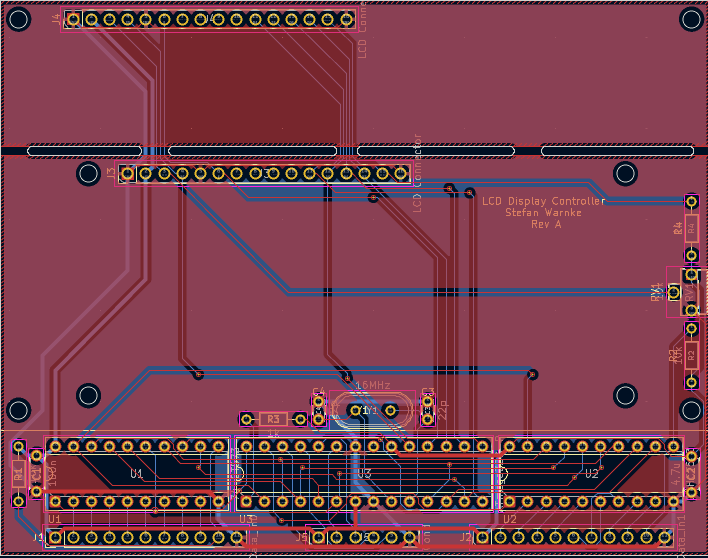

<h1 style="text-align: center;">LCD-DisplayController</h1>
<h2 style="text-align: center;">Controller board to display 2 and 4 lines on LCD modules</h2>
 

  

 
The <a href="https://github.com/StefansAI/TTL-6510-Computer">TTL 6510 computer.</a> was designed with connectors for plugging in <a href="https://github.com/StefansAI/HexDisplayController">HexDisplayControllers</a> for displaying register contents etc. Originally these hex displays were used for the micro code steps, instruction register and micro code outputs. Instead of looking up the meaning of instruction codes or the micro code bit group meanings, I decided to switch to multi line displays I had laying around. 
The instruction code and micro step counter can be displayed on a 2 line LCD text display module, while the 4 micro step signal groups can better be displayed on a 4 line LCD text display module. 
 
 

  

 
Both modules can be interfaced in the same way, so the schematics for both can be the same. There are two 8-bit ports to read in from. Since the Arduino processor doesn't have enough pins for both, they are multiplexed to one 8-bit bus. 
The LCD module is connected via 4 bit databus as in the example codes for the the Arduino. Then it only needs the resistor for the back light and a potentiometer for the contrast. 
 
 

  

 
The boards in the picture above are hand wired, but to make it nicer and repeatable there needs to be a PCB layout for both cases. The two LCD modules 16x2 and 20x4 have different dimensions and so I changed the design for 2 connectors in parallel, one to be used for the 16x2 module and the other to be used by the 20x4 module. 
Another 4-bit header was added to include reading in more bits that are currently wired to single LEDs on the side of the <a href="https://github.com/StefansAI/TTL-6510-Computer">TTL 6510 computer</a> board Rev A. Rev B is now routed to those headers.
 
 

  

 
The layout is made to plug in the two different sizes of LCD modules and to break off the part only needed for the larger module. The PCB had been made at <a href="www.PCBway.com">PCBway.</a> It was easy to upload the gerbers, get a quote and order the samples. The shipment took just few days.
 
 

  

 
The blank board as it came from <a href="www.PCBway.com">PCBway.</a> The quality was good and it worked right away as usual.
 
 

  

 
Board broken off and assembled for LCD 16x2.
 
 

  

 
Board fully assembled with LCD 16x2.
 
 

  

 
Board assembled for LCD 20x4.
 
 

  

 
Board fully assembled with LCD 20x4.
 
 

  

 
Similar to the <a href="https://github.com/StefansAI/HexDisplayController">HexDisplayController</a>, the processor code is written in the Arduino IDE, then programmed onto the UNO R3 board. The processor is then removed from the UNO board and plugged into the LCD board. Here is a screenshot of the MicroCode_In version containing the 6502 instruction strings.
 
 

  

 
The second screenshot shows string definitions for the micro code output signals. 

